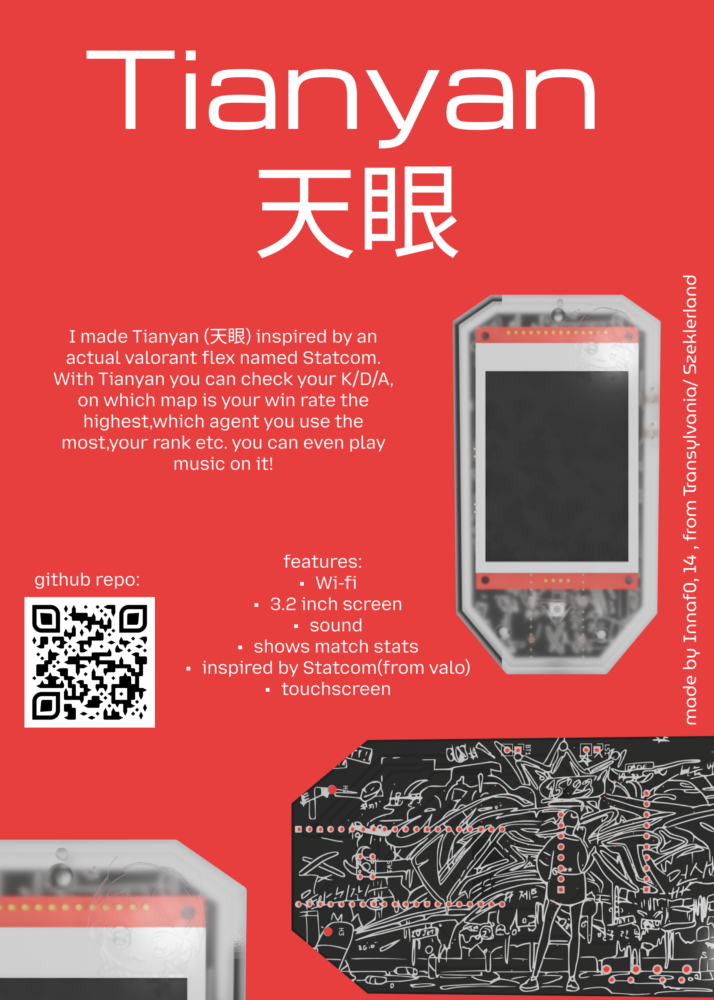

# valorant-flex
I made Tianyan (天眼) inspired by an actual valorant flex named Statcom. With Tianyan you can check your K/D/A, on which map is your win rate the highest,which agent you use the most,your rank etc. you can even play music on it!
This project came into existence bc I was lowk obsessed with valo :D

## Assembly steps:
1. get your PCB and put all your components on it
2. print the shell and the buttons
3. melt the heat set inserts into the frontshell
4. assemble everything together and tighten with screws
5. flash the firmware
 and you're done:D !!!
## 3D models :)
Here's the front side of my 3D model with valo art!!

and here's the backside with valo art again:)

## PCB with and without components!

Here's the front of my PCB w components:

Here's the back of my PCB w components

AND here's my PCB without components so you can see the art!!

## Schematic:3

Here's my schematic just incase lmao

## ZINE page(pdf.)

Here's my ZINE<3

## BOM ;)

Here's my BOM!!
| item:              | price per unit: | quantity:    | total price: | link:                                                 |
|--------------------|-----------------|--------------|--------------|-------------------------------------------------------|
| Display            | $10.52          | 1            | $10.52       | https://www.aliexpress.com/item/1005005334824151.html |
| Pi pico2           | $13.20          | 1            | $13.20       | https://www.aliexpress.com/item/1005009845096943.html |
| DAC                | $4.95           | 1            | $4.95        | https://www.adafruit.com/product/6250                 |
| Speaker            | $3.61           | 1            | $3.61        | https://www.aliexpress.com/item/1005005701427186.html |
| button             | $0.0182         | 1            | $0.0182      | https://www.aliexpress.com/item/1005007623070623.html |
| right-angle button | $0.0895         | 2            | $0.179       | https://www.aliexpress.com/item/1005006149378588.html |
| battery holder     | $0.68           | 1            | $0.68        | https://www.aliexpress.com/item/1005008468643124.html |
| PCB                | $0.40           | 1            | $0.40        | https://cart.jlcpcb.com                               |
| screws             | $0.077          | 3            | $0.230       | https://www.aliexpress.com/item/1005007264845313.html |
| heat set insert    | $0.070          | 3            | $0.209       | https://www.aliexpress.com/item/1005006798286851.html |
|                    |                 | total price: | $34.00       |                                                       |
